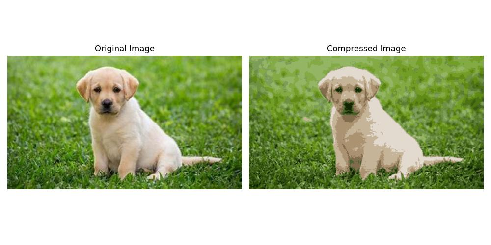

# Image Compression using Kmeans (Deeplearning.ai - Unsupervised Learning)

This project uses KMeans as an approach for comprssing image. The idea is to cluster colors from the image and quantize the colors to K-centroid colors.

