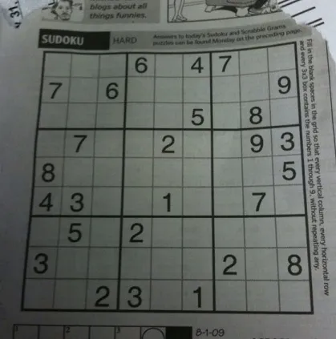
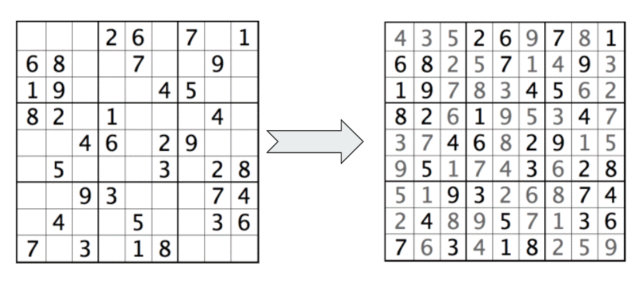

# Sudoku Solver

I recently started taking interest in playing and studying combinatorial games, like Sudoku, chess, 2048, etc. Among these, Sudoku has fascinated me with its blend of logic and combinatorial strategy. This motivated me to build a real-time Sudoku solver that can solve any Sudoku puzzle from an image.
The motivation behind this project is to combine my interest in combinatorial games with practical applications of computer vision and algorithm design. By creating a real-time Sudoku solver, I aim to deepen my understanding of image processing techniques and combinatorial problem-solving strategies.



#### Did You Know?

Sudoku fanatics have long claimed that the smallest number of starting clues a Sudoku puzzle can contain is 17. There are numerous examples of grids with 17 clues that have a unique solution, but no well-posed grid with only 16 clues has ever been found. This indicates that the minimum number of clues required for a valid Sudoku puzzle is 17(HARD LEVEL) `😁`

Generating sudoku boards is tougher problem than solving it ! `😥`

## Project Outline

This project is divided into two main modules:

1. **Sudoku Solver Module**:
   * The Sudoku Solver module takes the 2D matrix from the CV module and solves the puzzle. This module implements an efficient algorithm to solve the Sudoku puzzle and returns the completed board.
     In order to optimize performance solver is written in C++ and then uses as an API with python (Planned for now there is a brute force python solver)).

     
2. **CV Module (***Planned***)**:
   * The Computer Vision (CV) module is responsible for extracting the Sudoku board from an image. It processes the input image, detects the Sudoku grid, and extracts a 2D matrix representing the board.

## Project Structure

The project consists of the following components:

- `src/cv/utils.py`: (*Planned*) Contains the implementation of the CV module for image processing and Sudoku board extraction.
- `src/sudoku/solver.py`: Contains the implementation of the Sudoku solver algorithm.
- `main.py`: The main script that integrates the CV and Sudoku solver modules to provide a complete solution.
- `requirements.txt`: Lists the required Python packages to run the project.
- `README.md`: Project documentation.

## How to Use

1. **Install Dependencies**:

   - Clone the repository and navigate to the project directory.
   - Install the required dependencies using:
     ```bash
     pip install -r requirements.txt
     ```
2. **Run the Project**:

   - Execute the main script with an image file containing a Sudoku puzzle:

     ```bash
     python main.py -p <path-to-sudoku-image>

     		OR

     python main.py --path <path-to-sudoku-image>
     ```

## Dependencies

- OpenCV
- NumPy
- Other dependencies as listed in `requirements.txt`

## References

* [https://www.geeksforgeeks.org/sudoku-backtracking-7/ ](https://www.geeksforgeeks.org/sudoku-backtracking-7/): Good resource comparing varous algorithms for solving
* [https://dlbeer.co.nz/articles/sudoku.html](https://dlbeer.co.nz/articles/sudoku.html): Understanding generators

## How you can develop on this?

- Enhance the accuracy of the CV module in detecting and extracting the Sudoku grid (making it robust to adapt to diff levels of illumination and POVs).
- Develop a user-friendly interface for easier interaction with the solver (pygame/tkinter).
